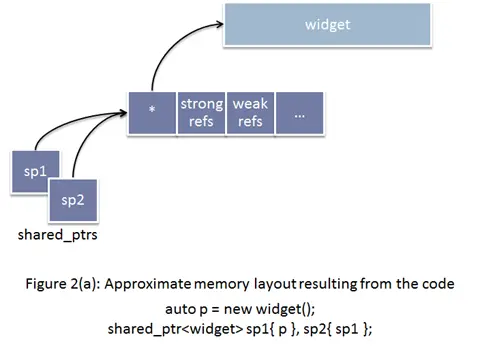
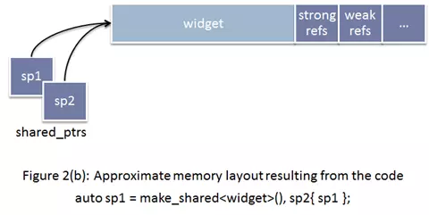

原文链接：https://www.jianshu.com/p/03eea8262c11

## make_shared的使用
```cpp
shared_ptr<string> p1 = make_shared<string>(10,'9');
shared_ptr<string> p2 = make_shared<string>("hello");
shared_ptr<string> p3 = make_shared<string>();
```

---
## 尽量使用make_shared初始化
C++11中引入了智能指针，同时还有一个模板函数std::make_shared可以返回一个指定类型的std::shared_ptr，那与std::shared_ptr的构造函数相比它能给我们带来什么好处呢？

### make_shared初始化的优点

#### 1、提高性能
shared_ptr需要维护引用计数的信息：
强引用，用来记录当前有多少个存活的shared_ptr正持有该对象，共享的对象会在最后一个强引用离开的时候销毁（也可能释放）。
弱引用，用来记录当前有多少个正在观察该对象的weak_ptrs。当最后一个弱引用离开的时候，共享的内部信息控制块会被销毁和释放（共享的对象也会被释放，如果还没有释放的话）。
如果你通过使用原始的new表达式分配对象，然后传递给shared_ptr(也就是使用shared_ptr的构造函数)的话，shared_ptr的实现没有办法选择，而只能单独的分配控制块。


如果选择使用make_shared的话，情况就会变成下面这样


std::make_shared(比起直接使用new)的一个特性是能提升效率。使用std::mark_shared允许编译器产生更小，更快的代码，产生的代码使用更简洁的数据结构。考虑下面直接使用new的代码

```cpp
std::shared_ptr<widget> spw(new Widget);
```
很明显这段代码需要分配内存，但是它实际上要分配两次，每个std::shared_ptr都指向一个控制块，控制块包含被指向对象的引用计数以及其他东西，这个控制块的内存是在std::shared_ptr的构造函数中分配的。因此直接使用new，需要一块内存分配给Wiget，还要一块内存分配给控制块。

如果使用std::make_shared来替换

```cpp
auto spw = std::make_shared<Widget>();
```
一次分配就足够了。这是因为std::mark_shared申请一个单独的内存块来同时存放Widget对象和控制块。这个优化减少了程序的静态大小，因为代码只包含一次内存分配的调用，并且这会加快代码的执行速度，因为内存只分配了一次，另外，使用std::make_shared消除了一些控制块需要记录的信息，这样潜在地减少了程序的总内存占用。