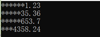
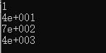
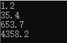

原文转载：https://www.cnblogs.com/feichangnice/p/9201822.html

C++输入输出流包含在头文件&lt;iostream&gt;中

## 流的定义如下：
通过设备驱动程序与键盘、屏幕、文件、打印机等进行交互， iostream 类提供与之交互的方法。
## 输出流
输出流的对象是字节目标，三个重要的输出流类是ostream、ofstream和ostringsream。
Ostream派生于basic_ostream支持预定义的流对象又：
cout标准输出
cerr标准错误输出，不经过缓冲
clog类似cerr，使用缓冲
注：缓冲是指将所有输出集中存放，然后一次性显示在屏幕上，避免多次刷屏。
## 格式控制
### 1. 输出宽度
输出宽度可以采用&lt;iostream&gt;中自带的width()函数，或者使用&lt;iomanip&gt;中的setw, setw 和宽度均不截断值。

#### 使用width()函数代码如下
```c++
#include "stdafx.h"
#include <iostream>   
using namespace std;
int _tmain(int argc, _TCHAR* argv[])
{
    double values[] = { 1.23, 35.36, 653.7, 4358.24 };
    for (int i = 0; i < 4; i++)
    {
        cout.width(10);
        cout << values[i] << '\n';
    }
    getchar();
    return 0;
}
```
#### 使用setw()函数
```c++
#include "stdafx.h"
#include <iostream>  
#include <iomanip> 
using namespace std;
int _tmain(int argc, _TCHAR* argv[])
{
    double values[] = { 1.23, 35.36, 653.7, 4358.24 };
    for (int i = 0; i < 4; i++)
    {
       cout << setw(10) << values[i] << '\n';
    }
    getchar();
    return 0;
}
```
程序运行结果：


### 2. 宽度设置
设置宽度后，cout默认空白填充，如果需要填充某个字符，可采用fill()或setfill()函数。
#### 采用fill()函数
```c++
#include <iostream>
using namespace std;

int main()
{
    double values[] ={1.23,35.36,653.7,4358.24};
    for(int i=0; i<4; i++)
    {
        cout.width(10);
        cout.fill('*');
        cout << values[i]<<endl;
    }
    return 0;
}
```
#### 采用setfill()函数
```c++
#include <iostream>
#include <iomanip>
using namespace std;

int main()
{
    double values[] ={1.23,35.36,653.7,4358.24};
    for(int i=0; i<4; i++)
    {
        cout.width(10);
        cout << setfill('*')<< values[i]<<endl;
    }

    return 0;
}
```
程序运行结果：


### 2. 精度设置
浮点的默认精度默认为六，如果需要修改，使用setprecision()。数字输出可以设置为固定型和科学型，输出形式采用setiosflags(ios::fixed)控制，fixed表示固定型，scientific表示科学型，默认为科学型。
#### 科学型代码
```c++
#include <iostream>
#include <iomanip>
using namespace std;

int main()
{
    double values[] ={1.23,35.36,653.7,4358.24};
    for(int i=0; i<4; i++)
    {
        cout << setprecision(1)<< values[i]<<endl;
    }

    return 0;
}
```
程序运行结果：


#### 使用固定记数
```c++
#include <iostream>
#include <iomanip>
using namespace std;

int main()
{
    double values[] ={1.23,35.36,653.7,4358.24};
    for(int i=0; i<4; i++)
    {
        // cout<<fixed;
        cout << setiosflags(ios::fixed)<<setprecision(1)
        << values[i]<<endl;
    }

    return 0;
}
```
程序运行结果：

### 3. 将整形数字按照不同进制输出
```c++
#include <iostream>
using namespace std;

int main()
{
   cout << 3536  << endl; // 十进制
   cout << dec << 3536 << endl;  //十进制
   cout << oct << 3536 << endl;  //八进制
   cout << hex << 3536 << endl; //十六制

   return 0;
}
```
程序运行结果：


### 4. 从文件输出数据 & 输入数据到文件
```c++
#include <iostream>
#include <fstream>
using namespace std;

int main()
{
    fstream fp;
    fp.open("test.txt",ios::in|ios::out);
    if(!fp)
    {
        cout<<"打开文件失败!"<< endl;
        return 0;
    }
    fp << "写入文件中";  // 将数据写入文件流中
    char buff[100] ;
    fp.seekg(ios::beg);  // 使文件流指向开始的头部，不然会指向最后写文件中的位置
    fp >> buff;     // 将文件流写入字符数组中
    cout << buff<<endl;   // 输出字符数组
    fp.close();  // 关闭文件流

    return 0;
}
```