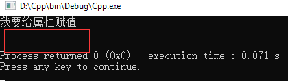

### 修改类中属性
```c++
#include <iostream>
#include <string>
#include <fstream>
using namespace std;

class Love
{
public:
    string name;
    void kiss(Love lo,string name);
    void ask();
};
int main(void)
{
    Love ov;
    ov.kiss(ov,"我要给属性赋值");
    cout << ov.name<<endl;
    return 0;
}
void Love::kiss(Love lo,string name)
{
    lo.name = name;
    cout << lo.name<<endl;
}
```
输出结果：


个人观点：本人总觉得应该会输出2个“我要给属性赋值”的值，又尝试用C#编写了一段代码运行，结果发现C#会输出2个“我要给属性赋值”，这样推论上述示例中 Love lo在传递过程中是值传，会在函数中产生副本lo，把要修改的属性值赋值给副本对象lo并放入栈中，等到出了所在的作用域后释放，所以在main中就不会出现ov对象的name属性值,而高级语言c#是视为引用传递(虽然两者写法一样  Love lo)，故而是2次输出。假如，把上述示例改为指针或地址引用传递，就会输出2次。所以如果要对类的属性进行修改还是使用指针或地址传参比较好。
    
