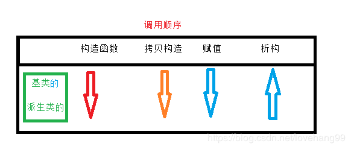

原文链接：https://blog.csdn.net/lovehang99/article/details/89577993

### 继承的概念及定义
#### 继承的概念
继承(inheritance)机制是面向对象程序设计使代码可以复用的最重要的手段，它允许程序员在保持原有类特性的基础上进行扩展，增加功能，这样产生新的类，称派生类。继承呈现了面向对象程序设计的层次结构， 体现了由简单到复杂的认知过程。以前我们接触的复用都是函数复用，继承是类设计层次的复用。

#### 继承的格式


#### 继承关系和访问限定符


#### 继承基类成员访问方式的变化
简单地说下C++类的3种继承方式，分别是public继承，protected继承，private继承。
最常用的还是public继承。**class默认的是private继承**，它的member如果没写权限也是默认private。**struct则相反，默认的是public继承**。结合下面的图示和代码，对C++的继承就有了比较清晰的认识了。


总结：
基类private成员在派生类中无论以什么方式继承都是不可见的。这里的不可见是指基类的私有成员还是 被继承到了派生类对象中，但是语法上限制派生类对象不管在类里面还是类外面都不能去访问它。

基类private成员在派生类中是不能被访问，如果基类成员不想在类外直接被访问，但需要在派生类中能 访问，就定义为protected。可以看出保护成员限定符是因继承才出现的。

实际上面的表格我们进行一下总结会发现，基类的私有成员在子类都是不可见。基类的其他成员在子类 的访问方式 == Min(成员在基类的访问限定符，继承方式)，public > protected > private。

使用关键字class时默认的继承方式是private，使用struct时默认的继承方式是public，不过最好显示的 写出继承方式。

在实际运用中一般使用都是public继承，几乎很少使用protetced/private继承，也不提倡使用 protetced/private继承，因为protetced/private继承下来的成员都只能在派生类的类里面使用，实际中 扩展维护性不强。

---
### 基类和派生类对象赋值转换
派生类对象 可以赋值给 基类的对象 / 基类的指针 / 基类的引用。这里有个形象的说法叫切片或者切 割。寓意把派生类中父类那部分切来赋值过去。

基类对象不能赋值给派生类对象

基类的指针可以通过强制类型转换赋值给派生类的指针。但是必须是基类的指针是指向派生类对象时才是安全的。这里基类如果是多态类型，可以使用RTTI(Run-Time Type Information)的dynamic_cast 来 进行识别后进行安全转换。


```c++
#include <iostream>
using namespace std;

class Person
{
protected:
    string _name;  //姓名
    string _sex;     //性别
    int _age;      //年龄
};

class Student : public Person
{
public:
    int _No;      //学号
};

void Test()
{
    Student sobj;
    //1.子类对象可以赋值给父类对象/指针/引用
    Person pobj = sobj;
    Person* pp = &sobj;
    Person& rp = sobj;
    //2. 基类对象不能赋给派生类对象
    //sobj = pobj;
    //3. 基类的指针可以通过强制类型转换赋值给派生类
    pp = &pobj;
    Student* ps1 = (Student*)pp; //这种情况转化是可以的
    ps1->_No =10;

    pp = &pobj;
    Student* ps2 = (Student*)pp; //这种情况转化时虽然可以，但是存在越界访问
    ps2->_No=10;
}

int main(void)
{
    Test();
    return 0;
}
```

---
### 继承中的作用域
在继承体系中基类和派生类都有独立的作用域。

子类和父类中有同名成员，子类成员将屏蔽父类对同名成员的直接访问，这种情况叫隐藏，也叫重定 义。（在子类成员函数中，可以使用 基类::基类成员 显示访问）
	
需要注意的是如果是成员函数的隐藏，只需要函数名相同就构成隐藏。

注意在实际中在继承体系里面最好不要定义同名的成员。(防止出现隐藏问题)

成员及成员函数的隐藏
```c++
#include <iostream>
using namespace std;

class P1
{
public:
    void fun()
    {
        cout << "haha" << endl;
    }
protected:
    int num =111;
};

class P2 : public P1
{
public:
    void fun()
    {
         cout << "哈哈" << _num <<endl; // 输出“哈哈999”
    }
protected:
    int _num =999;
};

void Test()
{
    P2 p;
    p.fun();
}

int main(void)
{
   Test();
    return 0;
}
```
有结果可以看出基类P1中的成员\_num 和成员函数fun()均被隐藏。

---
### 派生类的默认成员函数
6个默认成员函数，“默认”的意思就是指我们不写，编译器会变我们自动生成一个，那么在派生类中，这几个 成员函数是如何生成的呢？

1.派生类的构造函数必须调用基类的构造函数初始化基类的那一部分成员。如果基类没有默认的构造函数，则必须在派生类构造函数的初始化列表阶段显示调用。
2.派生类的拷贝构造函数必须调用基类的拷贝构造完成基类的拷贝初始化。
3.派生类的operator=必须要调用基类的operator=完成基类的复制。
4.派生类的析构函数会在被调用完成后自动调用基类的析构函数清理基类成员。因为这样才 能保证派生类对象先清理派生类成员再清理基类成员的顺序。
5.派生类对象初始化先调用基类构造再调派生类构造。
6.派生类对象析构清理先调用派生类析构再调基类的析构。

```c++
#include <iostream>
using namespace std;

class  A
{
public:
    A()
    {
        cout << "I am A" << endl;
    }
    ~A()
    {
        cout << "goodbye A" << endl;
    }
};

class B : public A
{
public:
    B()
    {
        cout << "I am B" << endl;
    }
    ~B()
    {
        cout << "goodbye B" << endl;
    }
};

int main(void)
{
    B b;
    return 0;
}
```
运行结果：分析到，初始化子类时先调用父类的构造函数，析构子类是时先调用子类的析构函数。

类的6个默认成员函数的功能：

**关键字 final：**
放在类定义的类名后，表明该类不能被继承。
有一类题目要求你实现一个不能被继承的类。
```c++
class Student
{
public:
    void fun()
    {
        cout << "haha" << endl;
    }
};   //该类可以继承

// 加关键字final，使该类不能继承
class Person final
{
public:
    void fun()
    {
        cout << "haha" << endl;
    }
};
```

---
### 继承与友元
友元关系不能继承，也就是说基类友元不能访问子类私有和保护成员。
```c++
#include <iostream>
using namespace std;
class Student;   //申明  注意定义顺序

class Person
{
public:
    friend void Display(const Person& p, const Student& s);
protected:
    string _name;    // 姓名
};

class Student : public Person
{
protected:
    int _stuNum; // 学号
};

void Display(const Person& p, const Student& s)
{
      cout << p._name << endl;
      cout << s.stuNum << endl;
}

int main(void)
{
    Person p;
    Student s;
    Display(p,s);
    return 0;
}
```
运行结果：


---
### 继承与静态成员
基类定义了static静态成员，则整个继承体系里面只有一个这样的成员。无论派生出多少个子类，都只有一 个static成员实例 。
```c++
#include <iostream>
using namespace std;

class Person
{
protected:
    string _name;
public:
    static int _count;
};

int Person::_count =100;

class Student : public Person
{
protected:
    int _stuNum;
};

class Gradue : public Student
{
  protected:
    string _seminarCourse;
};
int main(void)
{
    Student s1;
    Student s2;
    Student s3;
    Gradue s4;
    cout << Person::_count << endl;  //输出 100
    Student::_count =2000;
    cout << Person::_count << endl;  //输出 2000
    Gradue::_count =400;
    cout << Person::_count << endl;  //输出 400
    return 0;
}
```

---
### 复杂的菱形继承及菱形虚拟继承
单继承：一个子类只有一个直接父类时称这个继承关系为单继承。

多继承：一个子类有两个或以上直接父类时称这个继承关系为多继承。

菱形继承：菱形继承是多继承的一种特殊情况。

菱形继承的问题：从下面的对象成员模型构造，可以看出菱形继承有数据冗余和二义性的问题。在Assistant 的对象中Person成员会有两份。
二义性：
```c++
#include <iostream>
using namespace std;

class A
{
public:
    string name;
};

class B : public A
{
 protected:
    int num;
};

class C : public A
{
protected:
    int id;
};

class D : public B,public C
{
protected:
    string sex;
};

int main(void)
{
    D d;
    // 这样会有二义性，无法明确知道访问的是哪一个
    //d.name ="xxx";   //因为二义性编译不通过，所以注释掉
    
    // 需要显示的指出访问的是哪个父类的成员，解决了二义性问题，但数据冗余仍未解决
    d.B::name="xxx";
    d.C::name ="yyy";
    return 0;
}
```
虚拟继承可以解决菱形继承的二义性和数据冗余的问题。如上面的继承关系，在B和C的继承 A时使用虚拟继承，即可解决问题。需要注意的是，虚拟继承不要在其他地方去使用.
```c++
#include <iostream>
using namespace std;

class A
{
public:
    string name;
};

class B : virtual public A
{
 protected:
    int num;
};

class C : virtual public A
{
protected:
    int id;
};

class D : public B,public C
{
protected:
    string sex;
};

int main(void)
{
    D d;
    d.name ="xxx";
    cout << d.name<<endl;
    return 0;
}
```

---
### 继承的总结和反思
很多人说C++语法复杂，其实多继承就是一个体现。有了多继承，就存在菱形继承，有了菱形继承就有 菱形虚拟继承，底层实现就很复杂。所以一般不建议设计出多继承，一定不要设计出菱形继承。否则在 复杂度及性能上都有问题。

多继承可以认为是C++的缺陷之一，很多后来的OO语言都没有多继承，如Java。

继承和组合
（1）public继承是一种is-a的关系。也就是说每个派生类对象都是一个基类对象。
（2）组合是一种has-a的关系。假设B组合了A，每个B对象中都有一个A对象。
（3） 优先使用对象组合，而不是类继承 。
（4）继承允许你根据基类类的实现来定义派生类的实现。这种通过生成派生类的复用通常被称为白箱复 用(white-box reuse)。术语“白箱”是相对可视性而言：在继承方式中，基类的内部细节对子类可见 。继承一定程度破坏了基类的封装，基类的改变，对派生类类有很大的影响。派生类和基类间的依 赖关系很强，耦合度高。
（5）对象组合是类继承之外的另一种复用选择。新的更复杂的功能可以通过组装或组合对象来获得。对 象组合要求被组合的对象具有良好定义的接口。这种复用风格被称为黑箱复用(black-box reuse)， 因为对象的内部细节是不可见的。对象只以“黑箱”的形式出现。 组合类之间没有很强的依赖关系， 耦合度低。优先使用对象组合有助于你保持每个类被封装。
（6）实际尽量多去用组合。组合的耦合度低，代码维护性好。不过继承也有用武之地的，有些关系就适 合继承那就用继承，另外要实现多态，也必须要继承。类之间的关系可以用继承，可以用组合，就用组合。