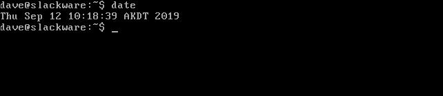

原文链接：https://www.infoq.cn/article/qtXThreWmvhZq70ACuk6
原文链接：https://www.howtogeek.com/440147/did-linux-kill-commercial-unix

  商业 Unix 销售额正急剧下降——这样的趋势，背后必然有着某些规律性的因素在左右。当初 Unix 普及的一切场景，如今都成了 Linux 的天下，Linux 还拓展到了 Unix 从未能企及的新高度。Linux 是否已经发展成完美且可靠的替代性方案，并开始挤占吞噬自己“老前辈“的生存空间？Unix 还能再度复苏吗？

### Unix 的发迹之路
  Unix 的最初版本诞生于 50 年前，也就是 1969 年。诞生地点，则是在当时尚隶属于 AT&T 的研究公司 Bell Labs 当中。五十岁生日快乐哦，Unix！实际上，它最初的名字其实是 Unics，代表着 UNIplexed Information and Computing Service，即复杂信息和计算服务。很明显，不知道什么时候，“cs”就变成了“x”。总之，初代 Unix 是在 DEC PDP/7 计算机上以 DEC 汇编语言编写而成的。
  Bell 之所以开发出 Unix，是为了管理内部专利申请的排版工作。Unix 开发团队认为，当时更新更强大的 DEC PDP/11/20 计算机绝对能够掀起一股风潮，所以他们专门制作这款排版程序来快速生成专利申请。在此之后，Bell 开始大规模使用 Unix，并在 1973 年发布了使用 C 语言重写的 Unix 4 版本。在随附手册的引言中，该团队表示“现在 Unix 的安装数量已经超过 20 套，预计未来还将进一步增长。”（摘自 K. Thompson 与 D.M. Richie 编写的〈Unix 程序员手册〉，1973 年 11 月第四版。）

  他们实在是太保守了！就在 1973 年，Ken Thompson 与 Dennis Ritchie 两位 Unix 核心架构师在 Unix 会议上发表论文之后，立刻收到了大量希望获取操作系统副本的请求。

  由于 AT&T 公司于 1956 年与美国政府达成了一项协议，因此 AT&T 方面不得从事“除普通运营商通信服务之外的任何其他业务“。结果就是，他们虽然能够从 Bell Labs 处获取产品许可，但却无法专心将其发展成商业业务。因此，Unix 操作系统以附带许可的源代码形式进行分发，而收取的成本仅包含运输、包装以及“合理的专利使用费”。
  由于 AT&T 无法将 Unix 视为商业产品，也无对其进行包装宣传，因此 Unix 没能带来任何营销收益。当时的 Unix 没有技术支持，也没有 bug 修复服务。尽管如此，它还是一路奔向高校、军事机构以及最终的商业市场——就是这么神奇。

  由于 Unix 使用 C 语言进行了重写，因此使用者们能够相对轻松地将其移植到新的计算机架构当中，使得 Unix 很快得以运行在各类硬件之上。结果就是，Unix 突破了 DEC 产品平台的限制，能够在几乎任何设备中顺畅工作。

---

### 商业 Unix 的崛起
  1982 年，根据另一项协议，AT&T 被迫放弃了对 Bell Labs 的控制权，并将后者拆分成多家规模较小的区域性公司。但这场动荡也使 AT&T 摆脱了以往的局限，能够正式推出 Unix 产品。1983 年，AT&T 方面提高了许可费用，并最终建立起技术支持与维护服务体系。

  正是这种商业化尝试，触动 Richard Stallman 创立了 GNU 项目，旨在编写不使用 AT&T 源代码的 Unix 版本。这里同样要祝 36 岁的 GNU 项目生日快乐！

  当然，原本的 Unix 用户可以按照许可协议继续使用 AT&T 的源代码。但这也意味着用户们需要自行修改并扩展代码、编写补丁，并在没有 AT&T 支持的情况下靠自己或者 Unix 用户社区完成这些工作。

  IBM、惠普、Sun、Silicon Graphics 以及众多其它硬件供应商在此期间都打造出自己的专用 Unix 商业版末或者类 Unix 操作系统。

  Unix 逐渐成为医疗及银行等市场中关键任务工作负载的首选操作系统。Unix 开始在航空、汽车及造船制造商手中为大型机及微型计算机提供助力，并在全世界的大学中贡献自己的力量。

  随着面向个人计算机的移植尝试，再加上 1985 年发布的英特尔 80386 处理器强大的性能助力，Unix 的安装量迎来猛增。现在，只要付费购买，大家就可以在大型机、小型计算机以及个人计算机当中轻松使用 Unix。

---

### Unix 之战
  八十年代末到九十年代初，人们为了争夺对 Unix 各细分市场的控制权以及标准化主导地位掀起了漫长而混乱的斗争。很明显，所有参与者都希望成为黄金标准的制定者。最终，标准终于出现，旨在解决混战引发的严重兼容性问题。

  这时横空出世的是 Single UNIX 规范（也包括 POSIX 标准）。如今，大写版本的“UNIX”已经成为 Open Group 的注册商标，仅允许符合 Single UNIX 规范的操作系统使用。总结来讲，“UNIX”是商标，而“Unix”代表一种操作系统类型，其中一部分有资格被称为“UNIX”。

  这段对历史的总结真的非常简短，实际上当时的潜在 Unix 用户面对着远超如今想象的混乱局面与令人困惑的难题。很明显，那时候客户根本不知道自己该把宝押在谁的身上——在持币观望的过程中，Unix 的销售额开始大幅放缓。

  这是 Unix 商业化道路上的一场自我毁灭，但真正的致命一击来自外部。

---

### Linux，生日快乐
  到 2019 年 8 月，Linux 已经度过了 28 年的成长岁月——再道一声生日快乐，Linux。1991 年，芬兰计算机科学专业学生 Linus Torvalds 发布了著名的声明，表示他正在着手进行操作系统内核的开发。动机非常简单：他想借此学习 386 CPU 的设计架构。

  Richard Stallman 的 GNU 项目当时已经完成了对诸多 Unix 操作系统元素的编写，但其内核 GNU Hurd 尚未准备就绪，甚至连初期发布都没有完成。Linus Torvalds 的 Linux 内核填补了这一空白。借助 Linux 内核以及 GNU 操作系统工具与实用程序，一种具备充分可操作性的类 Unix 操作系统就此诞生。纯粹主义者将其称为 GNU/Linux，而我们这些不那么较真的人就将其简称为“Linux”。我们对这两大阵营的贡献都表示充分的赞赏、尊重与认可，也为他们带来的成果欢欣鼓舞。

  自 1991 年开始，Linux 在功能性、完整性以及稳定性等方面一直在稳步提高，目前其身影已经广泛存在于数量惊人的不同用例与产品当中。

  目前仍在保持更新的最早发行版为 Slackware。其发布于 1993 年，以前一年发行的 Softlanding Linux System 版本为构建基础。Slackware 希望成为众多 Linux 发行版中最接近 Unix 的版本。我们很高兴看到这个项目仍在生存发展，而且拥有健康的技术社区与敬业的维护团队。

  
  Slackware Linux，时至 2019 年仍然健康地生存发展着

---

### Linux 的超越之路
  事实证明，类 Unix 免费操作系统拥有着巨大的吸引力，且对源代码的访问与修改能力也广受好评。如今，Linux 已经无处不在。

  - 它运行整个 Web。W3Techs 发布报告称，在前 1000 万个 Alexa 检索域名当中，有七成使用 Linux 系统。

  - 它运行着公有云体系。在 Amazon EC2 中，Linux 构成高达 92% 的服务器比例，拥有超过 35 万个独立实例。

  - 运行着世界上最快的超级计算机。全球五百强超级计算机，全部运行 Linux 系统。

  - 直奔太空。猎鹰 9 号火箭的飞行计算机使用的就是 Linux 系统。

  - 就在您的口袋当中。谷歌 Android 采用 Linux 内核。目前活跃 Android 设备超过 25 亿台，其中也包括 Chromebook 及其他设备。（事实上，苹果 iOS 的内核来自加州大学伯克利分校开发的 Unix 变种代码，即 Berkeley Software Distribution，简称 BSD。因此，无论您选择的是 iOS 还是 Android 智能手机，都逃不开这款类 Unix 操作系统的直接影响。）

  - 支持着您的智能家居体系。家里有没有安装智能设备？其中安装的，几乎一定是嵌入式 Linux。

  - 运行着网络体系。大多数管理交换机、无线接入点以及路由器都运行嵌入式 Linux 系统。

  - 为电信服务提供支持。无论是办公桌上的 VoIP 电话，还是通讯室中的电话交换机，其很大机率都运行着嵌入式 Linux 系统。

  - 运行在您的计算机之内。即使没有直接使用 Linux 台式机，微软仍然在 Windows 10 的 Windows Subsystem for Linux 2.0 版本当中引入了 Linux 内核。

  - 运行在您的汽车当中。特斯拉（以及其他各大汽车制造商）在车辆中使用 Linux 系统。

  事实上，除了 PC 台式机之外，Linux 在一切计算平台上都占据着主导地位。甚至微软自己也以桌面系统为起点，希望凭借 Windows Subsystem for Linux 进军 Linux 世界。

  但本文的讨论重点在于 Unix 与 Linux，而非 Linux 与 Windows。最重要的是，当初 Unix 普及的一切场景，如今都成了 Linux 的天下。另外，Linux 还拓展到了 Unix 从未能企及的新高度。以智能电视为例，同样是 Linux 一家独大。

  IBM 公司可以说是商业 Unix 世界的最后捍卫者，最直接的证据就是其 AIX 产品。但即使是这样，蓝色巨人也同样积极拥抱价值高达 340 亿美元（这里的 340 亿美元只是一种商业 Linux，即红帽 Linux 的价值）的 Linux 市场。事实上，蓝色巨人自己与 Linux 甚至也存在竞争关系。在全球超算五百强榜单中，最快的系统就来自 IBM，但其中运行的却是 Red Hat Enterprise Linux，而非蓝色巨人自己的 AIX。

---

### Linux 真的比 Unix 更强吗？

  不是的，二者其实差不多，只是 Linux 既能够运行在超级计算机上，又可以下探至 Raspberry Pi 等几乎一切计算设备。另外，我们可以获取 Linux 源代码，并享受由众多用户及维护者共同支持的热情技术社区。最重要的是，Linux 系统可以免费获取。

  如果需要商业支持，大家也可以选择红帽、Canonical 以及甲骨文的对应系统方案。这也正是 Linux 能够在某些企业级应用领域替代 Unix 的重要原因，毕竟很多公司打心里不信任免费的技术产品。他们愿意支付费用，并享受由此带来的保障与可靠性承诺。Linux 的兴起不仅是靠免费，更准确地讲，商业 Linux 击败了商业 Unix。

  那么，Linux 是否比 Unix 更成功？这个嘛，先要看这个成功是怎么定义的。如果是从操作系统的应用广泛度来衡量，那么确实可以说更加成功。如果从运行操作系统的设备数量角度看，答案也是肯定的。

  但仍有一个问题我暂时无法回答：红帽公司 340 亿美元的市值，是否超过了 Sun、惠普以及 Silicon Graphics 当初所有 Unix 商业许可以及运营周期中的收入总和？我不确定，但有这个可能。

---

### Linux 是否断了 Unix 的活路？

  **没错，Linux 就是断了 Unix 的活路。或者更确切地讲，Linux 切断了 Unix 的生存之路，并把它的路变成了自己的路。**

  Unix 仍然存在，运行着任务关键型系统且拥有极为稳定的实际表现。这一切都将持续下去，直到其所对应的应用程序、操作系统或者硬件平台彻底消失。但科技行业有这么句话，大意是只要还能正常工作，那就继续用着。因此，我猜永远都会有人在某个角落偷偷使用着自己的商业 UNIX 或者类 Unix 操作系统。

  但现有受众规模还能进一步扩大吗？考虑到 Linux 已经发展出如此丰富的变种，我觉得 Unix 再度复苏的可能性真的不大了。