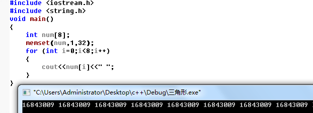
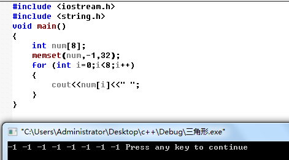

原文转载：https://www.cnblogs.com/yhlboke-1992/p/9292877.html

memset 函数是内存赋值函数，用来给某一块内存空间进行赋值的；
包含在<string.h>头文件中,可以用它对一片内存空间逐字节进行初始化；
原型为 ：
void *memset(void *s, int v, size_t n);  
这里s可以是数组名，也可以是指向某一内在空间的指针；
v为要填充的值；
n为要填充的字节数； 
例子1：
```c++
struct data
{
char num[100];
char name[100];
int  n;
};
struct data  a, b[10];
  
memset( &a, 0, sizeof(a) ); //注意第一个参数是指针类型，a不是指针变量，要加&
memset( b, 0, sizeof(b) );  //b是数组名，就是指针类型，不需要加&
```

例2：
char str[9];
我们用memset给str初始化为“00000000”，用法如下
memset(str,0,8); 
注意，memset是逐字节 拷贝的。

例3：
int num[8];
我们用memset给str初始化为{1,1,1,1,1,1,1,1}，
memset(num,1,8);//这样是不对的
一个int是4个字节的，8个int是32个字节，所以首先要赋值的长度就不应该为8而是32。
因为memset是 逐字节 拷贝，以num为首地址的8字节空间都被赋值为1，
即一个int变为0X00000001 00000001 00000001 00000001，显然，把这个数化为十进制不会等于1的。




所以，在memset使用时要千万小心，在给char以外的数组赋值时，只能初始化为0或者-1。
（如果用memset(a,1,20);就是对a指向的内存的20个字节进行赋值，每个都用ASCII为1的字符去填充，转为二进制后，1就是00000001,占一个字节。一个INT元素是4字节，合一起就是1000000010000000100000001，就等于16843009，就完成了对一个INT元素的赋值了。）
```c++
#include <memory.h> //我试了一下，C语言这么用，C++还可以用<cstring> 
#include <stdio.h>
 void main( void ) 
{ 
 char buffer[] = "This is a test of the memset function"; 
 printf( "Before: %s\n", buffer );
 memset( buffer, '*', 4 );
 printf( "After: %s\n", buffer );
 } 
```

输出:  
Before: This is a test of the memset function  
After: **** is a test of the memset function 