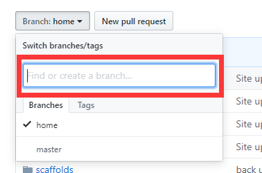
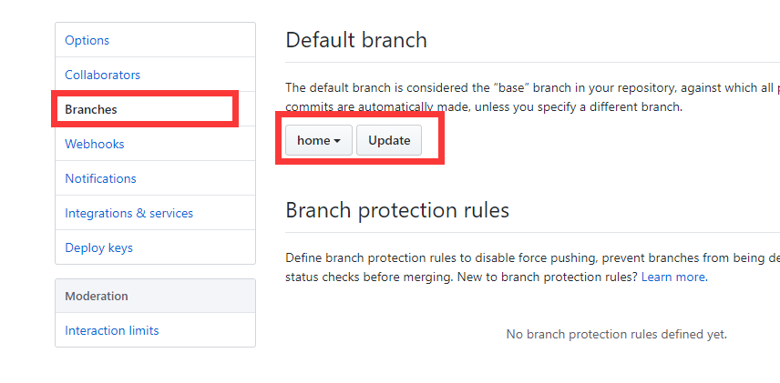

## 前期工作
1. 首先确保自己已经使用hexo在github搭建好了自己的个人博客

---
## 创建上传分支仓库
1. 在github新建一个xxx分支，并切换到分支，在该仓库->Settings->Branches->Default branch中将默认分支设为xxx，save保存。
   新建分支，并选中新建的分支，如下图：

   设置新建的xxx分支为默认分支，如下图：

2. 然后将该仓库克隆到本地，进入到本地的xxx.github.io文件目录。 
   进入本地的xxx.github.io后，在当前目录执行git branch命令查看本地当前所在分支，应为新建的分支xxx 
   添加新分支
   git checkout -b xxx
   切换远程分支到本地
   git checkout -b xxx origin/xxx
   切换本地分支
   git checkout xxx
3. 再将之前的源代码拷贝到xxx.github.io文件目录
4. 将主题的文件夹中的.git文件删除
5. git add . 、git commit -m "描述"、git push

---
## 在不同电脑上操作流程
1. git pull
2. git add . 、git commit -m "描述"、git push 更新源代码
3. hexo clean、hexo g、hexo d  更新编辑后的静态页面

---

