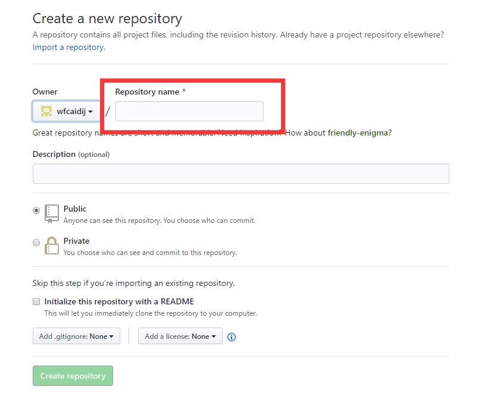
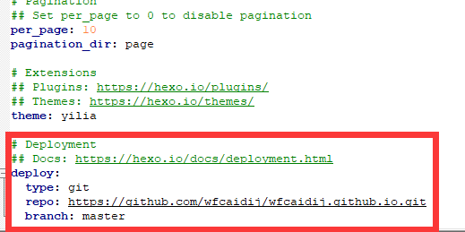

## 前期工作
1. 有一个github账号
2. 安装node.js、npm

---
## 开始搭建
1. 登录github官网创建仓库，点击New repository
    
    创建仓库完成
2. npm install -g hexo-cli
3. hexo init
4. 配置git用户名和密码    git config --global user.name "youname"  git config --global user.email "aa@qq.com"
5. hexo clean、hexo g、hexo s
6. npm install --save hexo-deployer-git
7. 设置_config.yml
   
   
---

